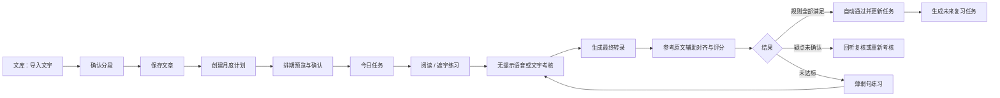
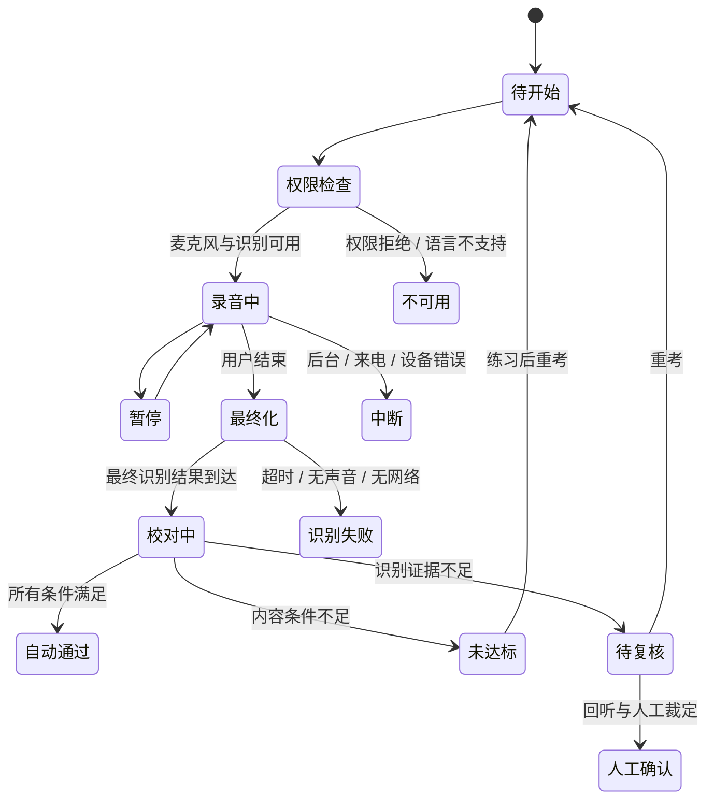

# 背诵计划 · 功能与流程设计

版本：第一版设计稿，2026-10-08。全部产品文案为简体中文。底座：Remember Me Flutter 客户端。界面方向：纯白、简洁、系统 iOS。产品名暂定“背诵计划”。

## 1. 产品目标与首版边界

用户导入一篇文章，按段落或自定义小节拆分；设定本月背诵哪些文章、每天新背几节；每天完成新背与复习；可以用语音或文字提交考核，依据原文校对，达到规则后自动完成任务。

首版闭环：**导入 → 确认分段 → 制定计划 → 今日任务 → 练习 → 无提示考核 → 最终校对 → 达标记录 → 后续复习**。

第一版优先粘贴、TXT/CSV 导入、手动分段、月度计划、本地数据、语音和文字考核、透明规则评分与录音回听。PDF/DOCX/OCR、跨设备同步、云端语音备选、整篇串联、按剩余时间自适应排期放在后续阶段，入口不能伪装成已可用。

首版以内容记忆为主要目标，发音容忍同音与正常口音；不把口语发音标准分当作背诵成绩。阈值只是初始产品参数，需真实中文录音验证。

## 2. 信息架构

| 主入口 | 用户问题 | 内容与动作 |
|---|---|---|
| 今日 | 今天背什么，先做哪一节？ | 日期、完成任务数、新背/复习队列、预计用时、继续任务 |
| 文库 | 我的原文与段落在哪里？ | 搜索文章、导入、文章详情、段落顺序、练习、创建计划 |
| 计划 | 本月能背完什么？ | 活跃计划、月度进度、每日任务、截止日期、调整/暂停、排期冲突 |
| 我的 | 学习记录和规则如何管理？ | 按日记录、掌握进度、考核规则、语音设置、录音保存、数据导出 |

向内页面：导入文字、确认分段、新建计划、计划详情、阅读练习、语音考核、校对结果、识别复核。考核页隐藏底部导航，避免录音误切页。

## 3. 文库与分段

### 导入

首版输入文章标题、可选作者/分类和正文。粘贴/文件导入后先生成草稿；解析失败不能覆盖已保存内容。无标题提示填写；空正文、全标点、只有空格不能保存。保留原文标点、换行与原始内容，评分用另一个规范化文本。

### 拆分策略

- 默认按空行拆分；连续空行当作一个边界，不把每个显示换行自动当成段落。
- 没有空行时提示“当前为 1 节”，提供按句切分或手动增加边界。
- 每节建议 40–200 字，仅作为提示；古诗可按句、演讲稿可按意思合并。不强行切断长句。
- 允许合并相邻两节、拆开一节、改节名、移动顺序，实时显示节数与字符数。
- 保存前显示完整顺序，不能只给摘要。未来文件/OCR 的识别疑点先在这里处理，考核原文必须确认。

### 原文版本

每篇文章和每节使用独立 ID；顺序单独保存，不能把“第 3 节”当 ID。修改正文会新建原文版本。旧成绩、录音、计划任务保留当时版本；新增考核用新版本。内容变化会提示相应段落需要重新确认掌握，不能继承旧通过记录。

## 4. 计划与排期

### 创建表单

计划名称、选中文章及段落、开始日、结束日、每个学习日新背节数、学习星期、每天提醒、考核规则。可排除已掌握段落。两种入口：按截止日推算建议节数，或按每天几节推算完成日。

计划内容快照：选中的文章版本与段落 ID、规则版本和时区。首版固定采用用户本地日历，示例时区 Asia/Shanghai；日期逻辑不依赖执行主机。

### 计算

1. 取待新背段落，按文章顺序排列；第一版顺序背完第一篇再背第二篇，可手动调整。
2. 找出开始至结束之间可学习日期，按每天节数生成新背任务。
3. `新背所需天数 = ceil(待背节数 / 每日新背节数)`；截止日当天可分配任务。
4. 预览展示新背完成日与余下巩固天数；完成新背不等于永久掌握。
5. 复习独立生成并合并到每日队列，不消耗新背节数。初期沿用上游复习间隔逻辑，经真实行为验证后再考虑替换算法。
6. 任务量超限时提示预计压力，给出增加每日节数、延长截止日、减少文章三种选择，不能静默调整。

样例：10月8日起，2篇共12节，每天新背1节，学习日为每天；预计10月19日完成新背，10月20–31日巩固。若仅周一至周五，需按真实学习日期重新计算。

### 每日队列与调整

- 默认今日先完成到期复习，再新背。逾期复习按薄弱程度与逾期天数排序。
- 一个段落一天最多一个相同类型的开放任务；多个计划引用同一段落同版本时复用完成证据，避免重复考核。
- 漏背保留历史未完成记录，用户选择“顺延剩余任务”“保持原截止日重新分配”；不伪造历史打卡、不自动把两天量堆到明天。
- 暂停只暂停新背提醒与新任务分配；用户可选择是否继续复习。恢复重新预览剩余排期。
- 调整计划不修改历史已完成记录。删除计划保留文章和历史记录，先确认或提供可恢复机制。

## 5. 背诵与考核

### 练习模式

阅读原文、播放朗读、遮字、首字提示、分句回忆、录音回听。练习可随时看答案，不参与自动考核打卡。薄弱句可单独练习，补练后仍需完成整节考核。

### 无提示考核

只显示文章名、节次、考核规则和录音状态，隐藏原文。用户可以选语音或文字。语音默认隐藏实时转录，只显示进度；用户主动显示转录时记录 `transcriptVisible`，仍无原文，但应在成绩中保留这项信息。是否将查看转录列为辅助由规则版本决定，首版严格模式列为辅助。

查看原文、首字提示、播放原文会先提示“本次将转为练习”，这次不能自动通过。暂停允许，切后台、来电、麦克风丢失需明确会话中断；保存已录片段和原因。可回听，但必须新建完整考核会话，不能拼接多次最佳片段伪造整节通过。

### 语音状态机

“结束”先停止录入、保留识别任务至最终结果，再评分；不可一停止就取消识别，拿最后一个临时结果打分。设置有界等待，超时保留录音并给重试转录；网络/识别错误不得自动记为背诵未达标。无有效人声也不能打卡。

### 已知原文辅助识别

原文用于提供词汇、专名、预期读音和段落边界，帮助解释录音；评分仍保留独立识别结果和音频证据，不能把没说出来的字补进去。候选词、时间位置与置信度只用于识别疑点，不等于内容正确率。

第一版：系统语音识别＋原文词汇辅助＋中文字符对齐＋拼音等价容忍＋疑点回听。此组合不是专业音素发音评测。若后续要求每个字发音分、错读/漏读声学判定，接入可传参考文本的专用语音评测服务，并用中文样本验证；强制对齐本身不能证明每个词已说出。

## 6. 评分与打卡

### 规范化与对齐

- 保存原文、原始转录与规范化结果三个版本，绝不覆盖原始证据。
- 忽略标点、空白、无意义停顿。简繁和数字等价按规则转换，保留映射，校对仍显示原文。
- 中文按字符/词组对齐，支持插入、替换、删除；不能按空格分词或同下标逐词比较。
- 正常重复和口头自我修正可采用明确的有限容忍策略，不能任意丢弃多说内容；策略版本进入记录。
- 同音字仅在语音证据支持且原文上下文无歧义时等价；关键数字/专名不能靠相似度放过。古文多音字提供人工词条读音，但不能将原文整段作为强约束补全。

### 首版可解释规则

`内容一致率 = max(0, 1 - (替换数 + 删除数 + 插入数) / 原文有效单位数)`。

`原文覆盖率 = (有效匹配数 + 有证据的替换单位数) / 原文有效单位数`。替换能表示该位置被背到，但仍扣一致率；删除不算覆盖。多说会扣一致率。覆盖率和一致率不是识别置信度。

通过必须同时满足：

1. 内容一致率 ≥90%。
2. 原文覆盖率 ≥95%。
3. 用户标记的关键项全部匹配；没设置关键项时此条件不适用。
4. 没有未处理的低置信识别疑点，存在有效语音或有效文字输入。
5. 这次是无提示完整考核，没有查看原文等辅助。

阈值允许按计划设置，首版建议90%/95%。判定用完整精度，展示一位小数：89.96%不能因显示90.0%而通过。保存规则快照，后续改阈值不追溯更改历史记录。

### 复核与人工通过

疑点页面提供原文、识别文字、对应音频片段与“识别错误/确实背错/重新考核”。人工确认保留原始分数、理由和时间，不能伪装成自动通过。首版默认人工确认只解决疑点并建议重考；若产品以后开放人工打卡，用独立来源 `manual` 和显式提示，统计单独显示。

### 完成规则

自动通过可生成成绩和任务完成事件，校对页显示“任务已完成”，底部是“返回今日”，不是先通过再要求用户点击才算打卡。数据写入失败显示“成绩已保存，任务同步待重试”，使用稳定键重试，避免用户重背。

单段通过 → 完成对应新背/复习任务 → 写入一次完成事件 → 更新段落掌握状态 → 生成下次复习。整日打卡仅在当天必做任务全部完成后生成；单段通过不能把全日标记完成。补做任务按实际完成日记记录，原计划日保留为逾期，不伪造连续天数。

## 7. 记录与统计

显示已完成任务、已考核通过段落、活跃计划、累计练习时长与近期成绩。区分：练习、有辅助、自动通过、人工确认、待复核。首次通过与持续掌握不同；复习失误产生薄弱标记和补练任务，不抹除历史通过。

可以逐条打开历史成绩回听录音。默认本地保存文本、转录与成绩；录音保存天数由用户设置，首版建议7天，可关闭。删除录音不删除成绩；保留记录“音频已清理”。若使用云端识别，须在用户选择引擎时说明数据去向，不能悄悄上传。

## 8. 数据模型

| 实体 | 关键字段 | 约束 |
|---|---|---|
| Article | id、title、author、source、version、createdAt | 正文修改生成版本 |
| Segment | id、articleId、articleVersion、order、title、text、keyItems | 节序可调整，ID不变 |
| Plan | id、title、segmentSnapshots、startDate、endDate、weekdays、dailyNewQuota、timezone、ruleId、status | 排期独立于复习算法 |
| Task | id、planId、segmentId/version、date、kind、status、completionEventId | 新背与复习分开，重复任务去重 |
| Attempt | id、segmentSnapshot、mode、startedAt、endedAt、audioUri、rawTranscript、alignedUnits、provider、ruleSnapshot、assistanceFlags、status | 同一会话保留最终结果和原始证据 |
| ReviewIssue | id、attemptId、audioRange、candidateText、confidence、decision、reason | 人工裁定不篡改原始转录 |
| CompletionEvent | id、taskId、attemptId、completedAt、source | 稳定唯一键，重复回调不重复计数 |
| MasteryState | segmentId/version、firstPassAt、lastReviewAt、nextReviewDate、level、weakness | 首次通过与复习掌握分开 |

时间用 UTC 存储、按计划时区显示；任务日期用本地日历日期。音频URI与业务数据分离，可独立清理。评分算法、规范化规则和语音引擎版本进入 Attempt。

## 9. 页面清单与异常状态

| 编号 | 页面 | 主操作 | 必须覆盖状态 |
|---|---|---|---|
| 01 | 今日 | 开始/继续任务 | 空计划、全部完成、逾期、复习过多 |
| 02 | 文库 | 导入文章 | 空文库、搜索无结果、导入错误 |
| 03 | 导入文字 | 预览分段 | 空正文、解析中、文件不支持、草稿 |
| 04 | 确认分段 | 保存文章 | 1节未切分、合并、拆分、长段提醒 |
| 05 | 新建计划 | 创建计划 | 日期无效、容量不足、只周末学习 |
| 06 | 计划详情 | 查看今日/调整 | 暂停、漏背重排、目标已完成 |
| 07 | 阅读练习 | 开始无提示考核 | 遮字、首字、字号、朗读不可用 |
| 08 | 语音考核 | 结束并校对 | 授权拒绝、无声、暂停、来电、最终化 |
| 09 | 达标结果 | 返回今日 | 已自动记账、记账待重试 |
| 10 | 识别待确认 | 回听/重新考核 | 同音、低置信度、录音缺失 |
| 11 | 我的/学习记录 | 查看历史 | 练习/自动/人工分类、录音已清理 |
| 12 | 考核规则 | 保存规则 | 一致率/覆盖率阈值、关键项、辅助模式 |
| 13 | 未达标结果 | 练薄弱句/重考 | 漏整句、错关键项、不足覆盖 |
| 14 | 文库空状态 | 导入第一篇 | 不展示假文章 |
| 15 | 文字考核 | 提交校对 | 正文隐藏、答案粘贴标为辅助 |
| 16 | 录音不可用 | 前往设置/文字考核 | 权限和技术故障不记背诵失败 |

## 10. 上游复用策略

优先复用 repository 层本地存储、实体身份、标签、导入、日期工具、录音与播放、复习规则；不复制经文专用检索及同步服务绑定。新建 Article/Segment/Plan/Task/Attempt，避免把所有计划和成绩塞入 Verse.note。

文章模型可以对现有文本实体建立兼容映射，但必须保持版本与段序独立。现有 Hive typeId/fieldId 不能与新增模型冲突，新增迁移与往返序列化验证。新增模型先本地化，不自动接入上游官方服务器。

## 11. 开发阶段与验收

### 阶段一：内容与计划
导入、分段、计划、今日任务、本地保存。验收：空行切分不丢字；拆分合并后拼接内容一致；截止日容量正确；漏背重排不改历史；不同设备尺寸不遮挡正文与操作。

### 阶段二：考核闭环
真实语音识别、最终化、文字考核、中文对齐、结果、疑点复核、幂等打卡。验收：无声不能通过；临时转录不能记账；漏一个字不造成后续全错；漏整句覆盖不足；89.96不自动通过；多次最终回调只完成一次；查看提示只记练习。

### 阶段三：复习与质量
复习队列、录音回听、统计、真实中文录音集、性能与可访问性。使用古文、现代文、数字、专名、方言口音、停顿、自我修正、环境噪声等样本，衡量误放过和误判失败，校准阈值。

完成 iOS 真机测试后再决定默认最低系统版本及离线能力；Windows 下的设计稿与原型不能替代麦克风、后台中断、签名和真机验证。

## 12. 原型说明

`ui/index.html` 是可点击设计原型，不采集麦克风、上传文件或产生真实学习记录。它实现可编辑文本分段、日期配额排期预览与示例考核结果；演示成绩使用确定性文本样本计算。展示板截图用于审阅视觉和信息架构。

演示原文来自公版《劝学》节选。达标样例只漏“而”，原文规范化29字、一致率和覆盖率28/29=96.6%；未达标样例漏末句，一致率与覆盖率16/29=55.2%。识别疑点样例将“蛟龙”识成“交通”，不能仅因分数达标而自动通过。

## 13. 个人账户、数据保留与换机

### 产品选择
首版必须有本机学习档案与完整导出/恢复。账户可选，首次使用不强制注册；只有用户要求云备份、换机或多设备同步时再登录。登录不代表必须上传录音。录音是否云备份独立选择，默认关闭。

底部「我的」进入「账户与数据」，展示当前档案位置与保留范围，再进入「备份与同步」。登录入口优先 Apple 登录，后续可增加邮箱；不做密码体系作为首版前置条件。原型只演示登录状态，不访问 Apple 账户服务。

### 保留范围
| 数据 | 本机 | 可选云端 | 规则 |
|---|---|---|---|
| 原文、段落、原文版本与关键项 | 长期保存 | 默认备份 | 历史成绩关联不可变原文版本 |
| 计划、排期与任务事件 | 长期保存 | 默认备份 | 保留调整历史，不回写旧打卡 |
| 考核原始转录、对齐、分数与规则快照 | 长期保存 | 默认备份 | 自动/人工/辅助来源不可丢失 |
| 复习队列与掌握状态 | 长期保存 | 默认备份 | 能由事件重建，避免重复排期 |
| 录音与语音证据 | 默认7天，可关闭或调整 | 默认不上传 | 音频过期标记证据不可回听，仍保留成绩 |
| 周报/月报/年报 | 由学习事件生成 | 可重建 | 报告缓存不是唯一的数据来源 |

本机持久化不能等同永久安全：删除 App、设备丢失或存储损坏可能丢数据。用产品内备份状态及导出入口帮助用户保存；不把这类说明塞进每次背诵流程。

### 同步与恢复
同步是跨设备增量合并；备份是独立恢复点，不能让误删立即使全部备份消失。首版先完成版本化档案导出/导入，云服务后续接入，使用自己的身份与数据服务，不接入 Remember Me 官方用户后台。

- 未登录数据拥有稳定 localProfileId；登录后明确选择合并本机档案或切换到云端档案，预览记录数与冲突。禁止静默覆盖。
- Attempt、TaskEvent 使用稳定 UUID 和幂等键；跨设备回调重复不重复完成任务。时间保存UTC、当地日期、事件发生时区。
- 原文内容冲突保留分支/版本；日程更改预览后选择；退出登录不自动删除本机档案。
- 离线先写本机，联网上传待同步队列。同步失败不撤销已通过的考核，展示待同步状态。
- 云端按用户隔离访问；鉴权令牌放系统安全存储。传输加密，账户删除明确说明删除范围和保留政策。
- 恢复前自动保存当前档案。全量备份有格式版本、校验和、实体数量；CSV成绩表只用于阅读，不能冒充可完整恢复的档案。

## 14. 周报、月报与年报

报告入口在「我的 → 学习报告」，顶部按周/月/年切换。默认查看最近结束周期；当前周期标「截至今天」，只统计已到期任务，不能把未来任务算失败。不强制登录，报告本机即可生成；登录后合并去重事件再生成。

| 周期 | 回答的问题 | 重点内容 | 后续行动 |
|---|---|---|---|
| 周报 | 这周完成怎样，下周先背什么 | 到期任务完成率、新掌握节数、复习考核、薄弱/待复核段落、有效学习时间 | 回听疑点、练薄弱句、调整下周配额 |
| 月报 | 这个月的目标是否完成 | 计划文章完成数与小节进度、新掌握内容、到期任务完成率、复习结果、文章列表 | 未完成目标顺延前先预览；已完成文章进入复习 |
| 年报 | 一年积累多少，隔久了还记得吗 | 完整通过文章、独立新掌握小节、学习日、月份分布、复习样本与长期内容 | 打开文章复习；整理下一年的学习目标 |

### 指标定义与边界
- 到期任务完成率 = 周期内到期且完成的必做任务 / 周期内到期必做任务。取消/暂停的未到期任务排除，计划调整保留快照；另列迟到完成，不涂改原来的按时率。
- 新掌握 = 原文版本中的小节首次无提示自动考核通过，按 segmentVersionId 去重；重考、复习通过不再算新掌握。完整通过文章须该文章版本所有要求小节均通过；多年统计同一内容版本不重复计数，改版另列说明。
- 复习保持率 = 有效无提示复习考核通过次数 / 有效无提示复习考核次数。技术失败、待复核、人工确认、辅助练习不纳入；存在多次尝试偏差，称考核通过比例，不据此宣称整体记忆能力。后续补充分间隔天数的首次复习表现。
- 不跨评分规则直接比较平均分。相同原文/规则才显示分数趋势；整体报告以任务和小节计数为主。
- 学习时长只计前台有效阅读/录音/输入活动，暂停、后台和空闲不计；年报小时数由分钟聚合后显示，保存原始精度。
- 学习日 = 有有效学习事件的日期；打卡日 = 当天全部必做任务完成的日期。两者分别计算。
- 分母为0显示「暂无复习考核」，不显示0%或100%；样本少注明次数。没有足够数据不生成虚构遗忘曲线或百分位排名。
- 周起始为周一，按档案时区划分；迟到同步后重新计算并注明更新时间。保留 reportVersion、eventWatermark 与数据覆盖范围。
- 报告截图/分享由用户主动发起，不自动公开原文、录音或账户信息。导出可隐藏文章名称。

### 示例口径
周报样例：上一完整周（9月28日—10月4日），完成5/6任务，2节新掌握，复习3/4通过，辅助练习3次。
月报样例：2026年9月，目标2/2篇、12节新掌握，26/30到期任务完成，12/14复习通过。
年报样例：2025年，24篇完整文章、186节新掌握、148学习日，复习312/360通过；月度小节数相加为186。所有数字仅为设计示例，三个周期不是同一套现场数据。

### 新增页面
| 编号 | 页面 | 主要操作 |
|---|---|---|
| 17 | 账户与数据 | 本机档案查看、登录、进入备份 |
| 18 | 备份与同步 | 选择录音范围、导出、恢复、立即备份 |
| 19 | 登录账户 | Apple登录或继续本机使用 |
| 20 | 学习周报 | 切换周期、练薄弱段落 |
| 21 | 学习月报 | 查看文章目标和完成内容 |
| 22 | 学习年报 | 月度积累、长期复习表现 |

### 后续实现优先级
阶段一同时落实本机档案和可恢复导出；阶段三建立事件统计与周/月报告；阶段四实现可选账户、同步、版本备份与年报。账户和报告不阻塞首次导入与背诵。上线云同步前验证跨账户隔离、首次合并、重复事件、时区边界、恢复回滚和音频关闭时不上传。
